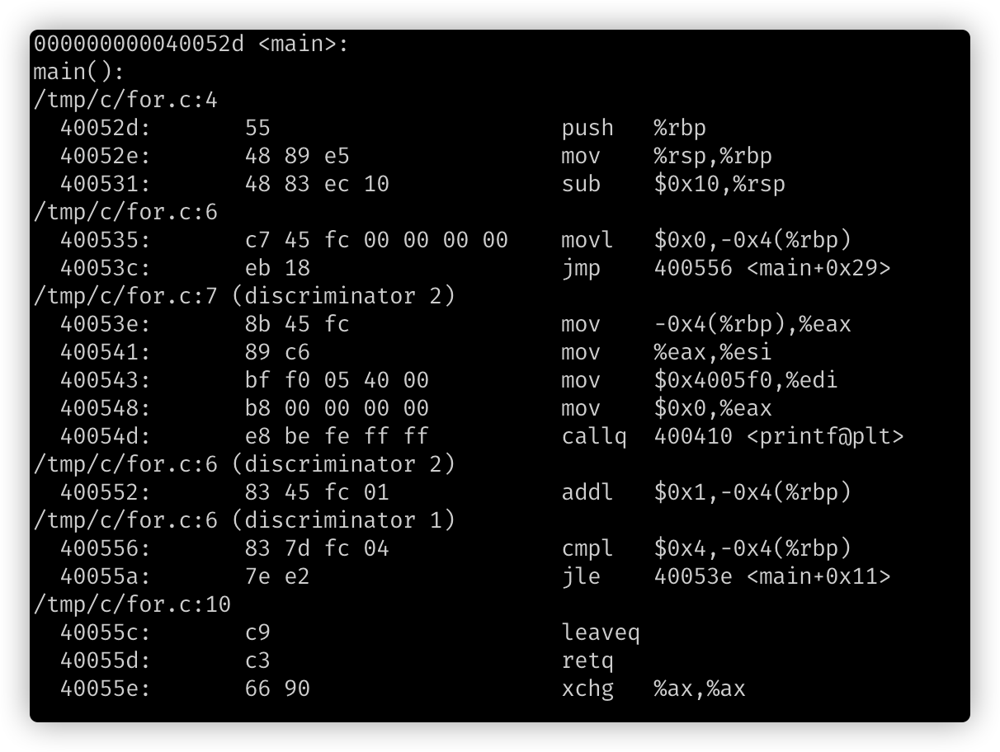
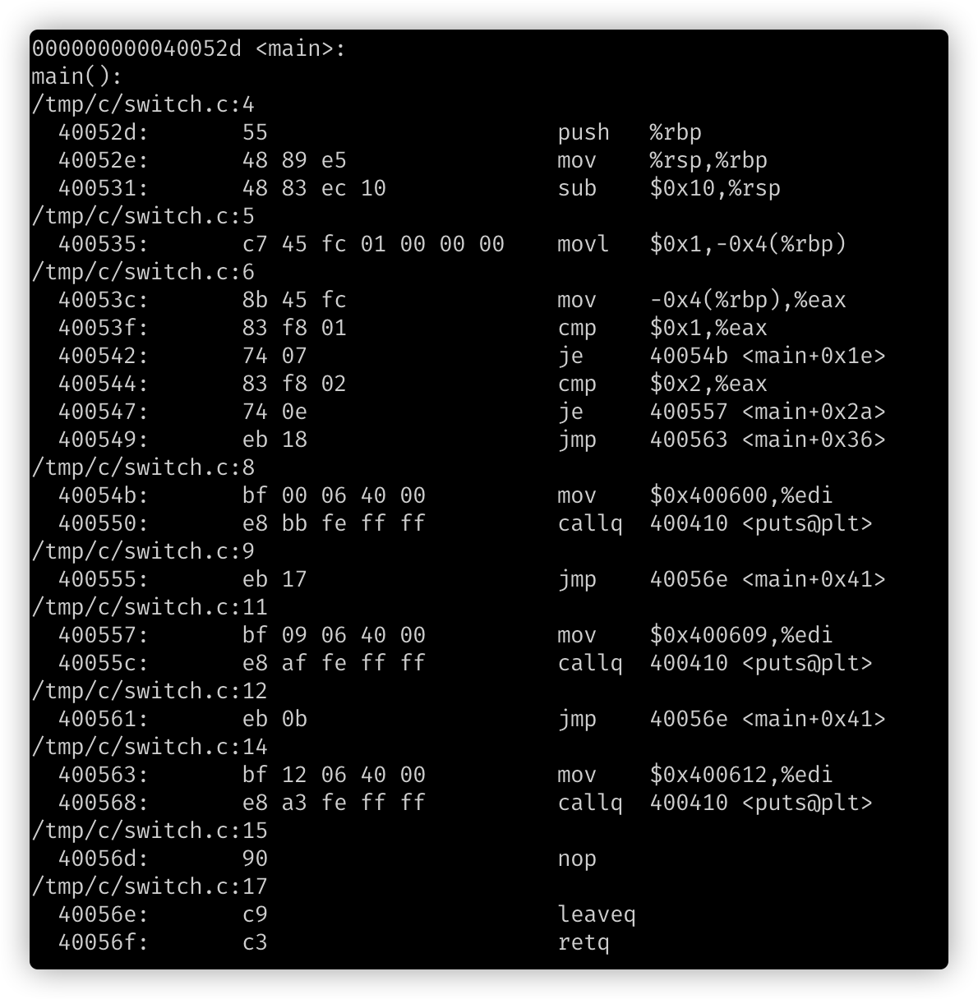
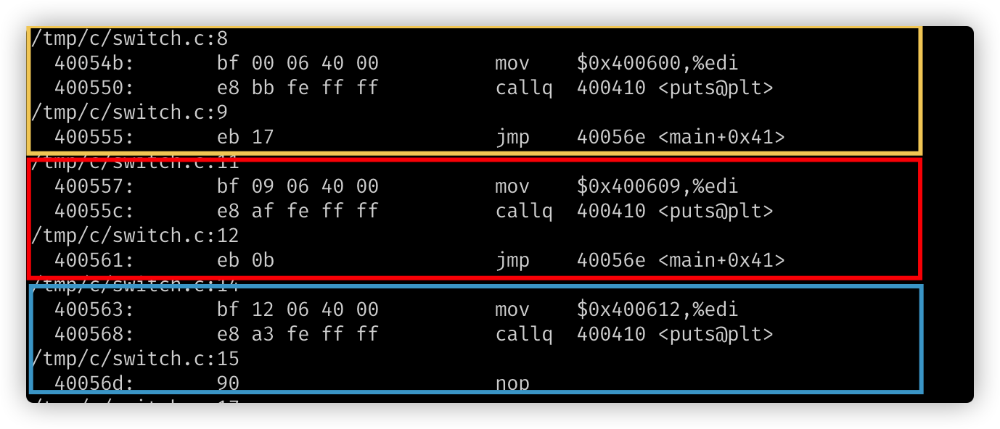
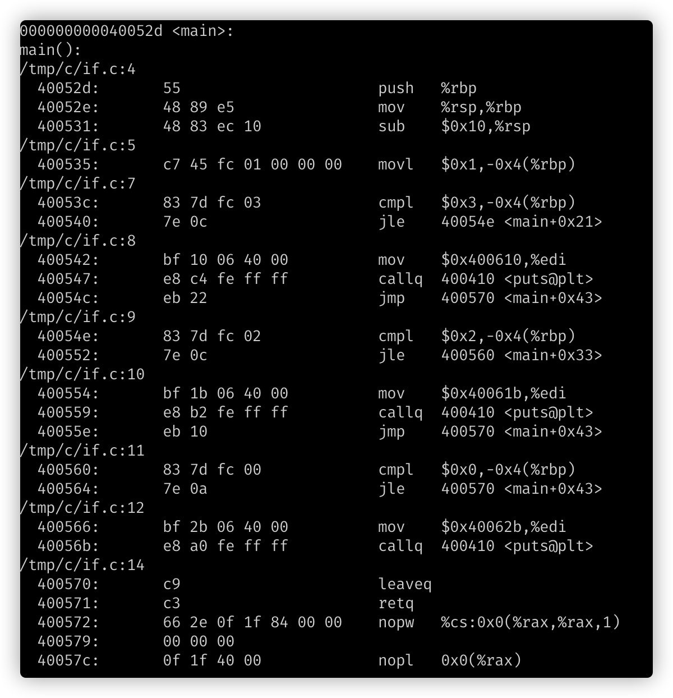

# For、Swith 和 If-Else 的汇编实现

以下分析均基于 C 语言的实现，并且没有启用指令优化。

## For 循环

先来看汇编如何实现 for 循环。下面是简单的一段 C 语言版本的 for 循环:

使用`objdump`进行反汇编以后，截取`main`函数部分如下:

`main`函数顺序执行后，在`400535`处将 a 初始化为 0。在`40053c:	eb 18                	jmp    400556 <main+0x29>` 这个指令中会无条件跳转到`400556`这个地址偏移量。在看`400556`这个地址的操作指令为`400556:	83 7d fc 04          	cmpl   $0x4,-0x4(%rbp)`

在 Intel X86 指令集中，`cmpl`用来比较后面两个操作数，并且根据比对结果来设置标志寄存器(Flag Register)。 后面的`jle`是条件跳转指令，如果`小于或者等于`时跳转到`40053e`。

在`40053e`处可以根据源代码看出是在执行`printf`。当顺序执行到`400552`后，执行`a++`操作。然后在执行一次`400556`的比较，根据比较结果来判断是跳回到`40053e`还是执行`40055c`正常退出。

总结一下，For 循环的汇编实现是这样的:

1. 变量初始化。
2. 判断是否到达终止条件。
3. 如果不到终止条件，则执行循环体，然后跳转回 2。
4. 如果到达则退出循环。

同时虽然变量的赋值、判断都是在同一行中完成的，但实际上会被拆解成很多条不相关的指令按照上面的逻辑进行执行。

## Switch 判断

先来看下面简短的 C 语言版本的 Switch 判断:

相对应的汇编如下:

`400535`是在执行 a 的变量初始化(int a = 1)。然后跳过下面一段汇编，直接从`40054b`开始看:

每个颜色表示一个 case 分支，每个分支的逻辑都一致，所以这三段汇编看起来大同小异。 只有最后`40056d`对应的是`default`的 break 操作。 直接给了一个 NOP，表示这个指令什么都不做。 但因为插入了一个 NOP，会浪费一个取值、译码周期。所以这个 break 可以直接移除。

然后在从`40053c`指令开始看，`mov    -0x4(%rbp),%eax`将 a 的值放入了 eax 寄存器。 `cmp    $0x1,%eax`比较 eax 寄存器的值和 1。`je     40054b <main+0x1e>`是条件跳转指令，如果相同则跳转到`40054b`。如果不相同则继续执行。`cmp    $0x2,%eax`和`je     400557 <main+0x2a>`则是判断是否要进入 case 2 的分支。

如果仍然不相同，则执行`jmp    400563 <main+0x36>`无条件跳转到`400563`。`400563`就是 default case。

因此 Switch 的汇编实现则是:

1. 变量初始化
2. 依次和所有的 case 进行比较。
3. 如果有命中的 case 则进入到分支内部执行。
4. 如果没有命中的 case 则顺序执行。

而进入 case 以后是否需要 break，则需要看各个语言的实现。 对应到汇编以后就是如果存在 break，就是 jmp 到 switch 外部。 如果没有 break，则就是顺序执行。

## If-Else 逻辑判断

下面是简单的`if-else`代码。

对应的汇编如下:

同样在`400535`是在做 a 的初始化(int a = 1)。紧跟着在`40053c`执行(a > 3)的判断。

如果满足则`jle`不执行，顺序执行后面指令，直到跳转到`400570`，也就是退出 if 判断。

如果不满足则`jle`会跳转到`40054e`,`40054e`是执行(a>2)的判断。 此处的逻辑和上面相同。

运行这个 if 逻辑，最差会判断三次，最优是判断一次。

因此汇编实现 if 逻辑判断是如下顺序：

1. 变量初始化
2. 判断是否满足 if 条件。
3. 如果满足则执行对应逻辑，然后 jmp 到 if 逻辑以外。
4. 如果不满足，则满足下个分支。

最终总结:

在没有启用指令优化时，无论是 swith 和 if-else 所消耗的指令周期都是一样的，也就是没有任何性能差异。当启用指令优化后， 这两种方式就会有差别。 switch 会在编译阶段，展开成一个大数组。 每次 case 比较不是依次比较，而是直接查表，时间复杂度由 O(n)变成 O(1)。 而 if-else 好像更倾向于是代码优化，也就是编译器会尝试优化 if-else 的判断逻辑。

从启用`-O2`后生成的汇编指令来看，和 switch 的指令几乎一致，也就是说将`if-else`转变成了`switch-case`。当然这一点是从汇编指令肉眼查看的，并未证实。

因此无论是从执行效率和代码可读性上来说，优选使用`switch-case`。
