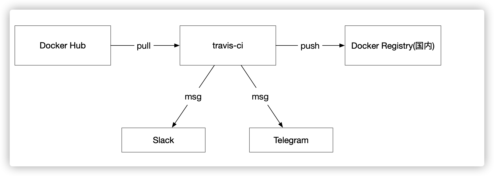
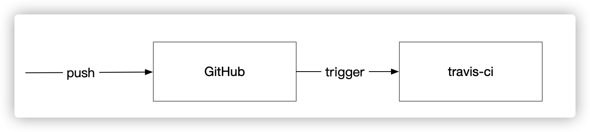
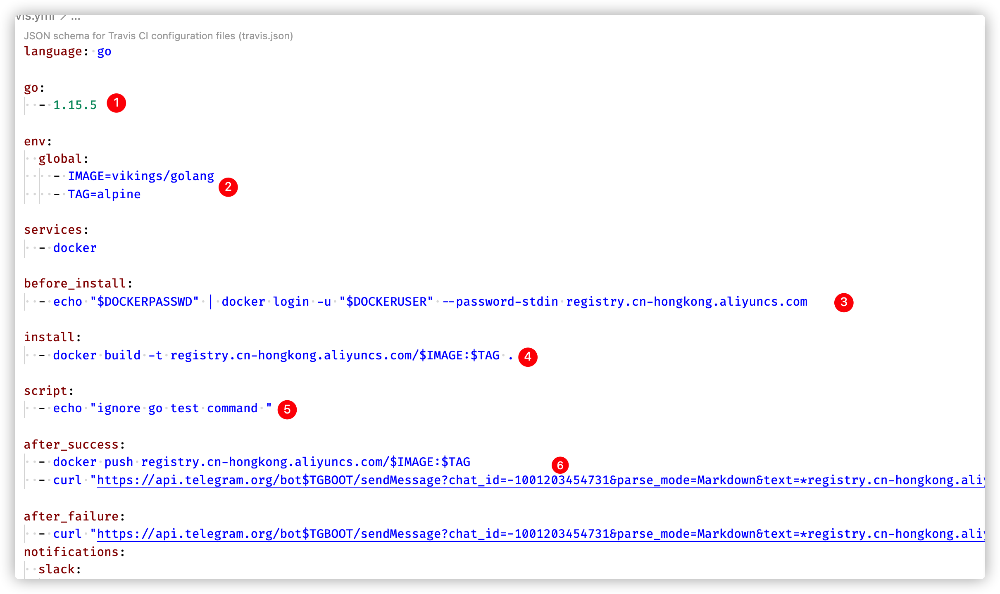

# 一种从国外同步docker hub的方式
> 一种通过'偷梁换柱'，从docker hub同步镜像到国内镜像仓库的方法

从国外的`docker hub`下载镜像完全看心情。 当下载大镜像时，经常会遇到超时或者失败的情况。

国内一些镜像仓库会定时从`docker hub`同步经常使用的镜像，但一些小众的镜像就不会同步。 因此如果需要使用这种镜像，只能自力更生，别无他法。

在本地下载时，即便选择翻墙受限于GFW的过滤，效果也不会特别好。 因此受困于此，我使用下面的方案来实现低成本同步。

大致的流程如下:

利用`travis-ci`所提供的免费算力，从`docker hub`下载指定镜像。然后将次镜像推送到国内镜像仓库(腾讯云或者阿里云等等)。然后本地在从国内仓库中下载镜像，将这套流程做成自动化后，下载时间大幅降低，同时下载成功率有大幅提高。

## 实现步骤

这个方案最重要的地方在于如何让`travis-ci`自动从`docker hub`下载镜像。 我借助`github`的webhook功能，当指定仓库出现`push`事件时，就会触发`travis-ci API`。 而后`travis-ci`会拉取指定的配置文件，通过解析指定文件获取到需要同步的镜像，然后开启后面的自动化流程。

方案的第一步就是`travis-ci`和`github`的关联，这个关联可以参考`travis-ci`官网步骤。

第二步是配置`github`的webhook，这一步参看`github doc`即可。

第三步是编写`.travis.yml`文件。 当`travis-ci`通过解析`.travis.yml`来组织后续动作。

下面是`.travis.yml`文件内容截图：

+ 1 用于初始化运行环境。 这里我选择使用golang环境
+ 2 通过环境变量来配置每次同步的镜像名称，这里每次都需要人肉操作，不符合自动化原则。
+ 3 因为需要推送镜像，所以需要登陆个人账号
+ 4 第一版方案是`pull --> push`，但考虑国外网速比国内好，因此可以顺路安装一些工具，因此就变成了`pull -> build -> push`这样的步骤。 第四步就是build过程。
+ 5 使用golang运行环境，所以忽略掉`go test`，否则会报错(因为没有go文件)
+ 6 构建成功后，就可以push到国内仓库了。  考虑到直接从国外push到国内同样需要过GFW，因此我选择推送到阿里云香港仓库，这样速度就快多了。

方案最后一步是自动发送消息， 我选择三种消息渠道(纯粹是想体验一下每种产品)：slack，telegram和gmail。

我使用的体验结果，如果团队合作那么就选择slack。 如果是个人使用可以选择telegram，gmail可以用来兜底。

## 方案如何运转

+ 修改`.travis.yml`, 修改第二步的环境变量。
+ 修改`Dockerfile`, 替换baseimage，然后添加个性化操作。
+ commit & push。 等待接受到成功消息后，在本地执行`docker pull`就可以了。