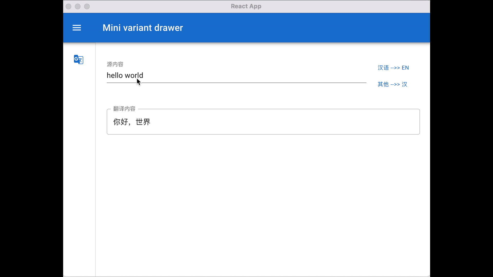

# Electron 入门教程 六
> 这篇文章主要介绍如何实现Loading进度条

本节效果演示(进度条出现事件短暂是因为后端处理太快了😒)


书再接上文，[前面一篇](/doc/front/electron/use-electron-05.md)中，我们复习了一下弹性布局，同时可以成功的获取到后端响应数据了。从上节课的demo演示中可以看到当我们点击[其他 --> 汉]以后，虽然可以获取到后端数据，但我们看不到具体进度，用户体验非常不好。

在这节课中，我们来看看如何添加Loading 进度条

## Loading进度条长什么样子

为了保持UI组件统一性，我们仍然渲染使用Material-UI中的Process组件。先来看看原生的进度条长什么样。


UI长的就是这样子。

我们下一步需要将Loading进度条融合到工具逻辑当中

## 如何融合

我们将融合步骤拆解一下：
1. 当用户点击[其他 --> 汉]按钮时，启动loading进度条，然后在页面中渲染出来
2. 当后端执行API调用以后，将数据通过IPC返回给前端页面
3. 前端页面接收到后端响应数据后，关闭Loading进度条。
4. 在从启动到关闭这段时间内，需要不停的计算进度值，当进度到100%以后，还需要重新归零再来一轮。


思路清晰以后，我们来看具体实现。 首先是修改UI布局添加按钮事件

### 修改布局

在页面中需要增加一个Loading的div层。

```html
<Grid item xs={12}>
    <div hidden={!loading}>
        <Box sx={{ width: '100%' }}>
            <LinearProgress variant="buffer" value={progress} valueBuffer={buffer} />
        </Box>
    </div>
</Grid>
```

`loading`表示是否显示。 当loading = true时，展现loading组件。当loading = false时，不展示loading组件。

`progress`和`buffer`表示当前进度和缓冲进度， 实际上是为了UI组件好看而已，并不表示实际缓冲值。

### 添加按钮事件

当用户点击按钮后，首先将loading置为true，这一步一行代码就可以搞定:
```ts
const [loading, setLoading] = useState(false);

....

setLoading(true)
```

此时就开始通过IPC调用主进程去调用API了，具体流程请参考[上篇文档](/doc/front/electron/use-electron-05.md)

如果不出意外，现在loading UI已经出现了，但进度条不会向前推进。 这是因为Loading的进度值目前是0，所以不能往前走。

下一步就是计算进度值，也就是组件中的`progress`和`buffer`两个值。

```ts
    React.useEffect(() => {
        progressRef.current = () => {
            if (progress > 100) {
                setProgress(0);
                setBuffer(10);
            } else {
                const diff = Math.random() * 10;
                const diff2 = Math.random() * 10;
                setProgress(progress + diff);
                setBuffer(progress + diff + diff2);
            }
        };
    });

    React.useEffect(() => {
        const timer = setInterval(() => {
            progressRef.current();
        }, 500);

        return () => {
            clearInterval(timer);
        };
    }, []);
```


我们通过`useEffect`表示存在副作用的代码，也就是允许出现不幂等的代码。通过:
```ts
setProgress(progress + diff);
setBuffer(progress + diff + diff2);
```

计算progress和buffer的值。当progress >=100后，归零重新开始。 这个逻辑不能仅仅计算一次，需要循环计算，因此通过一个定时器每隔0.5秒更新一次。

```ts
    const timer = setInterval(() => {
        progressRef.current();
    }, 500);

    return () => {
        clearInterval(timer);
    };
```

此时进度条就可以欢快滚动起来了。 当后端响应数据到达以后，我们就可以关闭Loading进度条了。

### 关闭Loading

关闭也就是一句代码的事儿：

```
        window.translate.on('translate-response', (d: string) => {
            setLoading(false)
            _handlerTranslateSuc(d)
        })
        window.translate.on('translate-error', (d: string) => {
            setLoading(false)
            _handlerTranslateErr(d)
        })
```

通过`setLoading(false)`就可以关闭loading的输出了。


**所有代码请参考 https://github.com/andy-zhangtao/electron-tutorials tutorial-06**