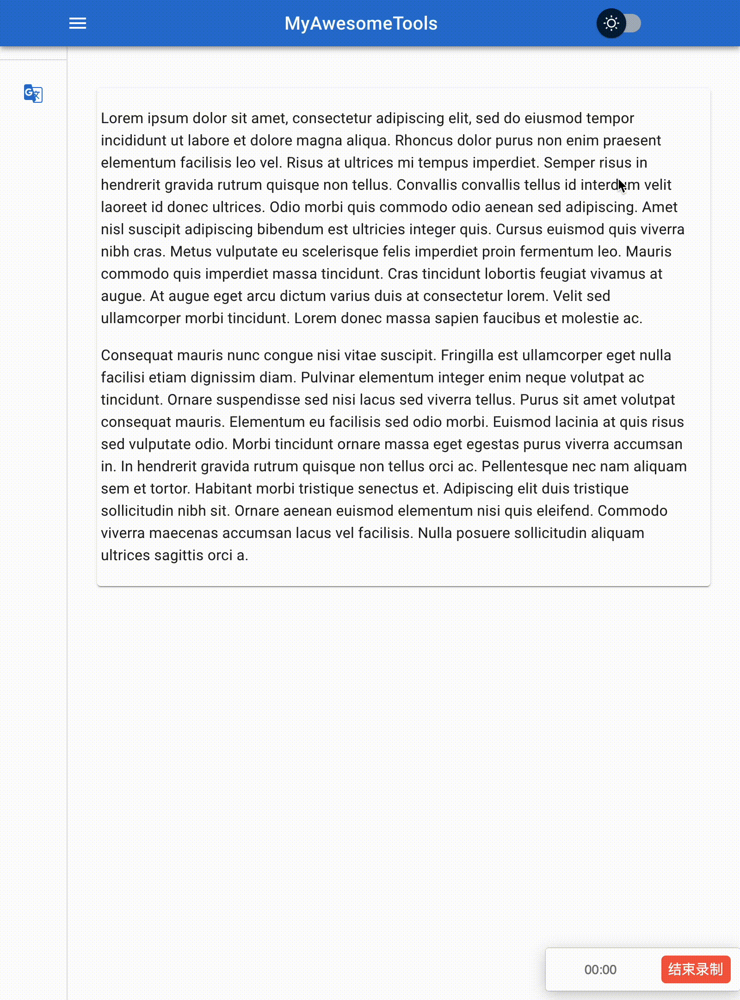

# Electron 入门教程 七
> 这篇文章主要介绍如何实现夜晚模式

本节效果演示


书三接上文，[前面一篇](/doc/front/electron/use-electron-06.md)中，我们尝试了如何添加Loading进度条。 对于UI来说，用户体验永远是放在第一位的，至于像代码质量、功能多少这些事情反而不是最重要的。 这一点是前段和后端开发最大的区别。

在本篇文章中，我们来看如何添加夜晚模式。

## 什么是夜晚模式

在mac操作系统中，mac会根据地区时间来判断是否进入了黑夜。 如果进入了夜晚，那么mac会自动修改页面主题搭配。 有的伙伴可能会混淆夜晚模式和暗黑模式，下面我们来看看夜晚模式和暗黑模式的区别。

### 夜晚模式和暗黑模式的区别

暗黑模式是指把所有 UI 换成黑色或者深色的一个模式。 从这个角度来说，夜晚模式是暗黑模式中的一个子类。 为什么这么说呢？

暗黑模式更多的目的是希望使用者更加专注自己的操作任务，所以对于信息内容的表达会更注重视觉性；

而夜间模式则更多是出于在夜间或暗光环境使用下的健康角度考虑，避免在黑暗环境中长时间注视高亮光源带来的视觉刺激，所以在保证可读性的前提下，会采用更弱的对比来减少屏幕光对眼睛的刺激。

同时，从使用场景上来说，暗黑模式既可以在黑暗环境，也可以在亮光环境下使用，可以理解为是对浅色主题的一种场景化补充，而夜间模式只建议在黑暗环境下使用，在亮光环境使用时很可能并不保证信息可读性。

### 为什么需要暗黑模式

1. 更加专注内容

试想一下，我们在电影院看电影时，为什么要全场关灯？甚至有些 APP，在影片的下方也会又一个模拟关灯效果的操作，来让整个手机屏幕变黑，只剩下视屏画面的部分，这都帮助我们可以更专注、更沉浸在当前的内容下。

色彩具有层级关系，深色会在视觉感官上自动后退，浅色部分则会向前延展，这样对比强烈的层次关系可以让用户更注重被凸显出来的内容和交互操作；尤其在信息负责界面内层级关系的合理拉开对操作效率都有明显的促进作用。

2. 在暗光环境下更加适用

因为环境光与屏幕亮度的明暗差距在夜间会被放大 ，所以亮度对比所带来视觉刺激也更加明显，使用暗色模式可以缩小屏幕显示内容与环境光强度的差距，同时在暗光环境下使用APP也会更加柔和，说白了柔和不伤眼。

3. 随大流

其他APP都有这个功能了，你不来一个总感觉缺点什么东西。


暗黑模式需要考虑每种元素在明亮和黑暗两种场景中的配色，对于我们来说工作量太大，所以我们仅仅实现夜晚模式。 夜晚模式只需要修改背景色和字体颜色两个地方就可以了。 

## Electron如何实现夜晚模式

对于Electron实现夜晚模式来说，只需要完成两步：
1. 检测当前系统模式(黑暗还是明亮)
2. 根据系统模式选择不同的配色主题

### 检测系统模式

Electron的渲染进程提供了一个可以检测系统模式的方式，通过`useMediaQuery('(prefers-color-scheme: dark)');`可以获取到当前操作系统的主题颜色。 

```ts
const prefersDarkMode = useMediaQuery('(prefers-color-scheme: dark)');
```

如果`prefersDarkMode`是`true`，则表示当前操作系统是暗黑配色，反之则是明亮模式。

### 选择配色主题

`material-ui`提供了用于修改主题的component：`ThemeProvider`。 `ThemeProvider`有默认的主题配色，但默认的主题配色没有明亮和夜晚，所以不满足我们的需求。

但还好，`material-ui`允许我们扩展主题，通过`createTheme`类，我们可以创建多套主题。

### 选择主题

作为app来说，应该将修改主题的权利交给用户。所以我们虽然可以通过获取系统主题的方式自动修改主题，但也要需要提供一个用户自行调整主题的方式。所以我们添加一个`switch`组件来控制当前主题。 

综上所述，我们完成夜晚模式的步骤是下面这样的：

1. 用户选择主题: 明亮 or 夜晚。
2. 根据用户选择的主题修改APP系统配色
3. 根据系统配色选择不同的颜色主题

原理分析到此，下面来看代码实现。

## 代码实现

### 用户选择主题

```html
<FormGroup >
    <FormControlLabel
        control={<MaterialUISwitch sx={{ m: 1 }} onChange={(event: any) => _handlerToggleTheme(event)} />}
        label=""
    />
</FormGroup>
```
通过封装一个Switch控件，允许用户选择明亮或者夜晚。 当用户进行切换时，触发`_handlerToggleTheme`函数。


### 处理切换

在`_handlerToggleTheme`函数中，是用来修改系统配色的：

```js
const _handlerToggleTheme = (event: any) => {
    if (event.target.checked) {
        window.darkMode.dark()
    } else {
        window.darkMode.light()
    }
}
```

当然渲染进程是无法直接修改系统配色的，`window.darkMode`是通过IPC对外暴露的API。 真实定义在`preload.js`中：

### IPC

```js
contextBridge.exposeInMainWorld('darkMode', {
    dark: () => ipcRenderer.invoke('dark-mode:dark'),
    light: () => ipcRenderer.invoke('dark-mode:light')
})
```

在`preload.js`中定义两个操作：`darkMode.dark`和`darkMode.light`。 分别对应的是主进程的两个监听回调，当用户切换时，通过IPC就会分别触发主进程的两个自定义监听操作了。

### 主进程

```js
    ipcMain.handle('dark-mode:dark', () => {
        nativeTheme.themeSource = 'dark'
        return nativeTheme.shouldUseDarkColors
    })

    ipcMain.handle('dark-mode:light', () => {
        nativeTheme.themeSource = 'light'
        return nativeTheme.shouldUseDarkColors
    })
```

主进程通过调用`nativeTheme.themeSource`来修改当前APP的配色方案，这样做的好处是渲染进程只需要获取一次系统配色就可以自动完成主题的切换，而不需要修改每个页面的主题。 

### UI渲染

绕了一大圈，其实就是完成UI渲染的时候可以自动切换主题：
```js
    const prefersDarkMode = useMediaQuery('(prefers-color-scheme: dark)');

    const theme = React.useMemo(
        () => createTheme({
            palette: {
                background: {
                    ...(!prefersDarkMode ?
                        {
                            default: '#ffffff',
                            paper: '#ffffff',
                        }
                        : {
                            default: '#303040',
                            paper: '#424252',
                        }),
                },

                text: {
                    ...(!prefersDarkMode ?
                        {
                            primary: grey[900],
                            secondary: grey[800],
                        }
                        : {
                            primary: '#ffffff',
                            secondary: '#707070',
                        }),
                },
                mode: prefersDarkMode ? 'dark' : 'light',
            },
        }),
        [prefersDarkMode],
    );
```

`渲染进程`通过`useMediaQuery`判断当前主题是否发生变化，当发生变化时(`[prefersDarkMode]`)，就可以判断使用哪一套配色方案了。

至此我们就完成了明亮和夜晚模式的切换。 

**所有代码请参考 https://github.com/andy-zhangtao/electron-tutorials tutorial-07**