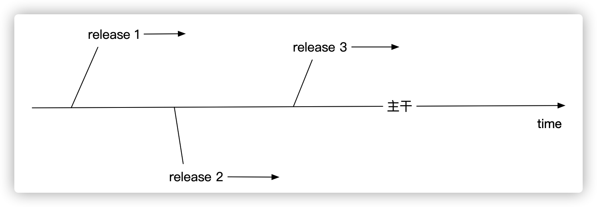
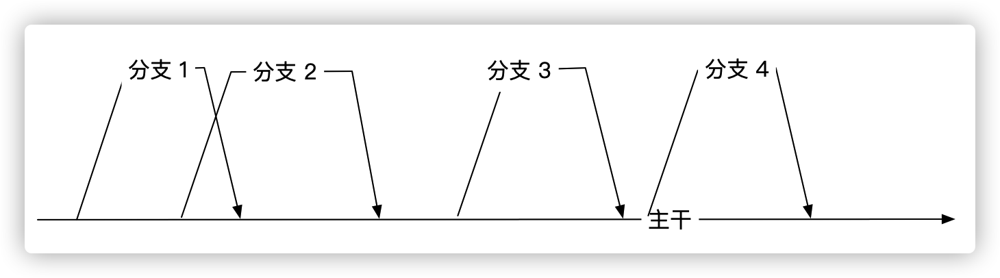
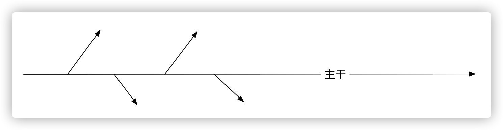

# Git 分支开发的三种模式

采用`Git`作为版本管理工具的团队，一定会面临如何选择`开发-发布`模式的问题。常见有三种模式：

1. 主干开发，分支发布
2. 分支开发，主干发布
3. 主干开发，主干发布

这三种模式适用于不同的场合，选择何种模式取决于模块拆分颗粒度，团队发布频率和冲突概率。下面来看这三种模式具体使用规则。

## 主干开发，分支发布

团队所有成员基于主干进行开发，在特定时间点从主干拉取一个分支进行发布。这种模式有两个要点：
1. 分支仅仅用于发布，不会用于开发。 也就是这个分支用于功能回归验证，当验证通过以后就会发布。如果验证过程中出现bug，那么也是在这个分支上面进行修复，但修复完成以后需要马上同步到主干。所以发布分支存活时间应该会非常短，正常情况不会超过1天。

2. 分支的拉取需要依靠主干的tag。 也就是在主干中需要根据功能点设置tag信息，这样才能准确拉取分支。

采取这种分支，可以实现加快发布频率。 例如功能A完成了开发，并通过了测试，就可以从主干中拉取包含有功能A的分支进行发布流程。

但采用这种模式对团队有如下要求：

1. 主干代码质量要求非常高。如果主干代码出现问题，会block住所有人的工作进度，因此从开发人员本地push到主干时必须要有自动化验证步骤。 只有通过自动化验证以后的代码才允许push到主干。
2. 团队协作要求较高。 从开发人员本地到主干的时间不能超过1天，否则push时就可能出现很多的冲突。 这个时间间隔的越长，冲突的概率就越大。因此最好团队每天固定时间点进行code commit和code push。
3. 主干和分支存在不同步的情况。 假设发布分支修复bug时，这个bug还不会体现在主干上。 如果发布分支完成使命后就被删除了，那么修复的bug可能仍然会被带入到下个发布中。 这种情况也只能依靠自动化手段保证。

## 分支开发，主干发布

团队成员依据功能特性从主干拉取一个特性分支，在分支上面进行开发，测试和发布。 当完成发布以后，将分支代码合并到主干上面。 主流开源项目都采用这种方式。

这种模式好处就是分支之间可以并行开发，相互不干扰。发布的时候可以自由组合分支，例如单独创建一个发布分支，将分支1和分支2都合并到发布分支上面，就可以将这两个分支上面的特性发布出去。

采用这种模式对团队的要求如下：

1. 模块拆分要科学，相互之间不能有耦合。耦合从来就是万恶之源，耦合的越多出问题的概率就越大。假设模块A和B之间存在耦合，很可能会出现分支1修改了A的相关代码，但分支2却没有修改代码的情况。 因此当分支2发布之后，分支1中关于A的代码变更就会消息的情况。

2. 分支之间可能存在干扰(干扰只能尽可能减少，但理论上无法避免)，所以需要一个可靠的自动化测试手段来保证每次分支合并到主干都不会影响主干代码。

3. 分支上面的git commit需要言简意赅，并且可追溯。 当每次分支代码合并到主干时，分支上面的commit如果不整理就会全量合并到主干，主干commit信息会显得臃肿不堪。所以合并时需要精简分支commit信息，尽可能做到原子性(commit信息参考[这篇文章](https://blog.devexp.cn/#/doc/git-commit))。

## 主干开发，主干发布

大道至简的典范，当团队进化或者相互非常默契以后，就不需要那么多花里胡哨的范式了。 直接主干开发，主干发布就显得理所当然了。

这种模式，所见即所得。 主干代码是什么样的，发布后就是什么样子。但这种模式对团队要求无疑也是最高的，其要求团队一定要有：

1. 完整的CI/CD流程。 每次代码变更都会触发CI/CD流程，只有通过所有的自动化测试之后才会进行自动化构建和自动化发布。只有这样才能保证不会出现一行代码造成服务中断的情况。
2. 代码有严格的验收标准。 验收标准包括但不限于单元测试、集成测试和UAT测试。有洁癖的团队还会要求代码风格必须保持一致。只有这样的代码才允许合并到主干流程中。

一旦进入到主干流程的代码，就随时处于就绪状态，随便一个commit都可以发布到线上。无疑这才是敏捷的最佳实践