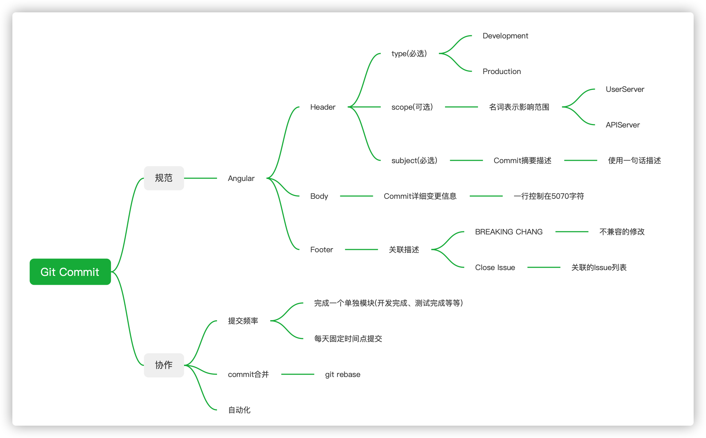
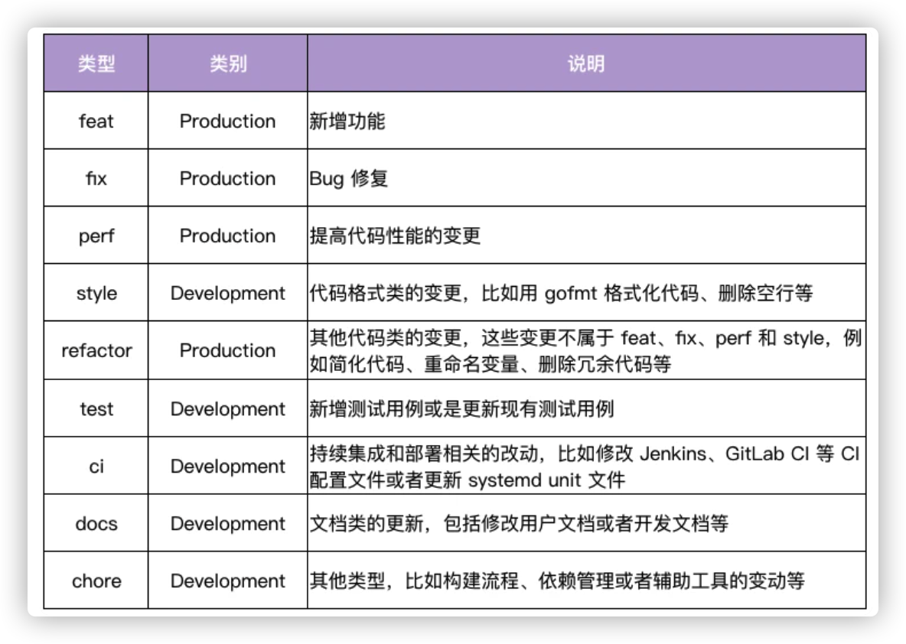
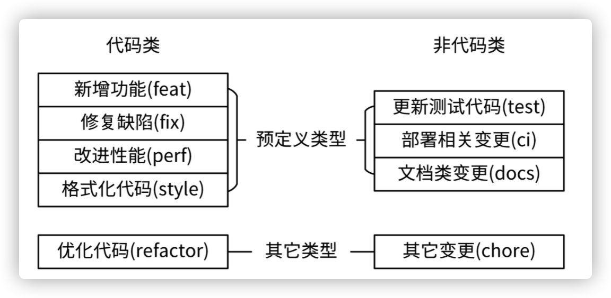
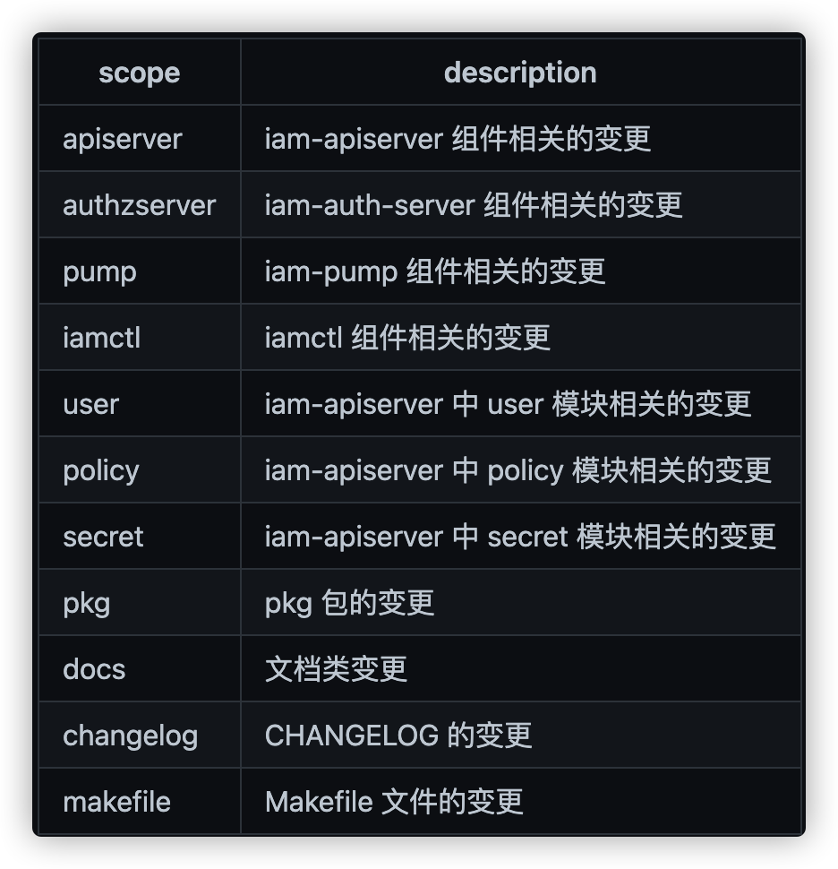
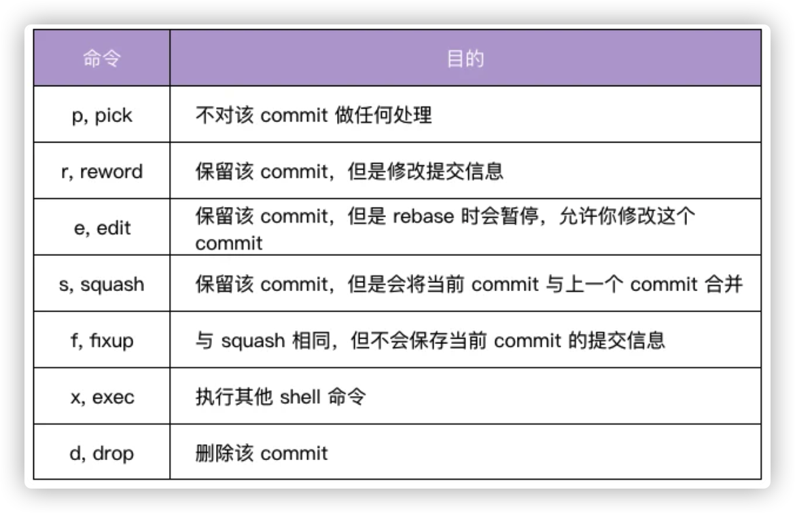

# Git Commit 规范总结

## 规范的Commit有哪些好处

- 清晰的知道每次Commit变更内容
- 可以根据Commit内容进行有效的信息过滤
- 基于规范的Commit可以生成CHANGELOG
- 依据特定的Commit信息可以触发特定的CI/CD流程
- 生成语义化的版本号

虽然规范化的Commit有这么多的好处，但相对应会有一些使用成本。 按照使用场景来分，存在:个人开发和团队开发两种场景。 每种场景可以忍受的成本不一样。因此下面分别描述。

## 个人开发
如果是个人开发，则不需要遵守强规范约束，按照"简单既是美"的原则就可以了，只要自己能看懂，其他人稍加思考就能明白就达到目标了。 我个人常用的规范如下:

+ 🆕NEW: 必要的信息。当你添加一些全新的东西时使用。

    例如 NEW: 添加 Git 忽略的文件

+ 👍IMPROVE: 必要的信息。用于改进/增强代码段，如重构等。

    例如 IMPROVE: 远程 IP API 函数

+ ✅FIX: 必要的信息。修复 bug 时使用

    例如 FIX: Case converter

+ ✍️DOC: 必要的信息。添加文档时使用，比如 README.md 甚至是内联文档。

    例如 DOC: API 接口教程

+ 🚀RELEASE: 必要的信息。发布新版本时使用。

    例如， RELEASE: Version 2.0.0

+ ✅ TEST: 必要的信息。发布新版本时使用。

    例如 ✅ TEST: 模拟用户登录/注销

## 团队开发

在团队开发模式中，强约束会带来规范化，自动化和文档化的好处，虽然成本有些高，但带来的收益也不低。 而目前开源届存在很多的Commit规范， 下面介绍Angular规范。

`Angular`规范模版如下：
```
<type>[optional scope]: <description>
// 空行
[optional body]
// 空行
[optional footer(s)]
```
+ Header
    - 包含type、scope和subject三部分
    - Header是Commit的摘要描述，所以控制在一句话完成描述
    - type、scope分类参考附录
+ Body
    - Commit的详细描述。可以使用多行，但每行需要控制在50～70个字符
+ Footer
    - 相关关联描述，例如涉及到相关的Issue列表，不兼容说明等等。

下面是`Angular Commit`示例

```
fix($compile): couple of unit tests for IE9
# Please enter the Commit Message for your changes. Lines starting
# with '#' will be ignored, and an empty message aborts the commit.
# On branch master
# Changes to be committed:
# ...

Older IEs serialize html uppercased, but IE9 does not...
Would be better to expect case insensitive, unfortunately jasmine does
not allow to user regexps for throw expectations.

Closes #392
Breaks foo.bar api, foo.baz should be used instead
```



## 附录
### A - Header Type 类型


### B - Header Type 分类


### C - Scope 示例


### D - Git  Rebase 常用操作
