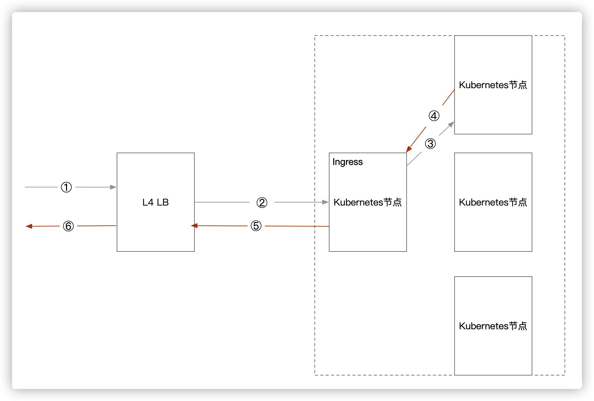
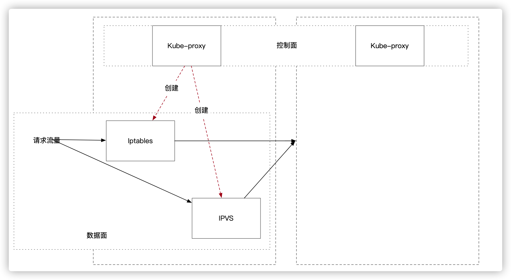
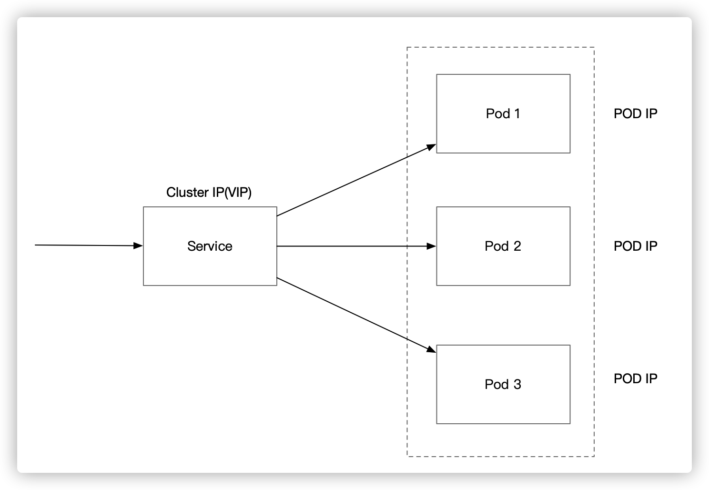
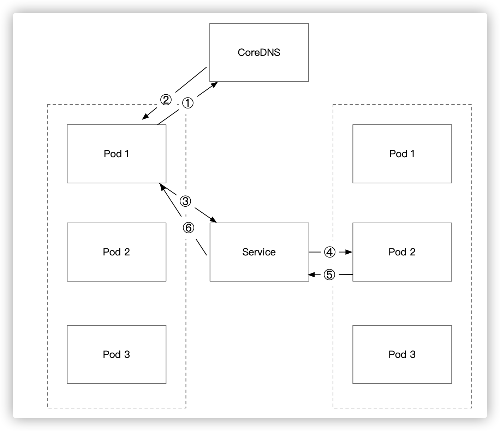
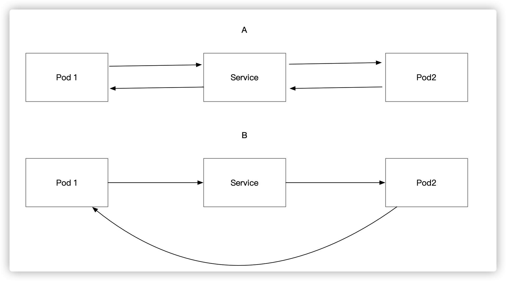

# 浅入浅出 Kubernetes 流量分析

Kubernetes流量大致分为以下四种:

|方式|发起方|访问方式|
|---|-----|------|
|A|集群外|Ingress|
|B|集群外|3层路由|
|C|集群内|svc|
|D|集群内|3层路由|

本文首先从A(集群外通过Ingress访问集群服务)开始聊Kubernetes网络。

方式A的网络拓扑大致如下:

为了简化模型，假设服务存在于Kubernetes其中一台节点上。外部流量经过LB(4层)后，被转发到Ingress节点(假设使用Nginx Ingress)中。

Ingrss节点收到流量请求之后，按照Http协议进行分析，解析出Host和Uri。 而后根据节点中内置的Iptables/Ipvs规则将流量转发到对应的目标节点之上。

目标节点接受到流量请求之后进行业务逻辑处理，而后将响应流量返回给来源节点。

来源节点接受到服务响应流量之后，同步返回给下游LB。 下游LB将流量返回给调用方。

下图是节点中转发流量的示意图:

在每个节点中都存在`kube-proxy`组件。这个组件用来为每个服务(Service)生成一个VIP(虚IP)，并且服务维护相对应的路由策略。

在集群网络中，存在`控制平面`和`数据平面`。 控制平面用来监控集群网络拓扑变化，并负责维护本节点的路由策略以满足拓扑变化。 数据平面则用来真实处理网络请求和响应流量。也就是说，`控制平台负责制定规则，而数据平面则用规则处理流量`。

具体到节点，集群中所有的`kube-proxy`就是控制平面。kube-proxy生成的`Iptables`规则或`Ipvs`规则就是数据平面。

在当前集群创建策略中，优先创建`Ipvs`规则，如果当前节点不满足`Ipvs`运行条件，则退化到`Iptables`规则中。

**Ipvs和Iptables的有哪些区别？**

+ 性能

在低流量情况下， Ipvs和Iptables性能几乎没有差异。当遇到高流量时，Ipvs凭借O(1)的查询算法复杂度会比使用O(n)的Iptables有更好的性能。同时Iptables会使用netconntrack跟踪每个建立成功的链接，所以当网络流量非常高的时候， net conntrack有可能会变成一个瓶颈。

+ 负载均衡

Iptables只有轮询这一种负载均衡算法(实际上，是计算一个随机数然后根据随机数决定路由到哪个Endpoint)。 Ipvs则支持轮替、最少链接、目标地址哈希、源地址哈希、最短预期延迟和从不排队这几种负载方式。

**Service和Pod的映射关系**

每个Pod如果需要对外提供服务，就需要提供一个网络端口(endpoint)供外部访问。但是当Pod意外崩溃或者重启后，这个网络端口也会随之变化。为了使外部调用方对这种变化保持毫无感知，就需要对调用方隐藏Pod的网络端口，只需要提供一个唯一且固定的endpoint即可。 而Service正是为了解决这个问题。

一个Service是一组Pod的逻辑访问地址，每个Service都拥有一个固定不变的IP，其称之为Cluster IP。 这个IP是一个虚IP，当客户端访问此IP时，Service会通过某种路由策略(Ipvs或者Iptables)将请求流量转发到真实的Pod，从而完成代理的功能。

每个Service会**自动评估后端服务的健康度**，当后端服务处于**不可用**状态时，Service会自动将不可用的后端服务从服务列表中摘除掉。而不可用的状态则来自于Pod的**可用性探针**结果。因此为了保证Service可以正常代理网络流程，每个Pod都需要仔细维护**可用性探针**。

Service使用`selector`来和后端服务进行`绑定`，即在`同一个命名空间`中指定的Service会将指定`selector`的Pod自动添加到Service的服务列表之中。

访问Service有两种方式:

+ 环境变量(存在局限性，不建议使用)
+ DNS(调用方只能在集群内部使用)

使用DNS的流量拓扑如下:

- Service建立成功后，会向CoreDNS注册自身信息。
- 调用方Pod向CoreDNS请求解析指定Service的VIP地址。
- CoreDNS回复VIP地址
- 调用方Pod向此VIP地址发起流量请求
- Service根据其实现的路由规则转发流量到后端Pod
- 后端Pod处理完成后，返回响应流量到Service
- Service将响应流量返回给调用方Pod

这里有个有意思的地方需要特别注意, Service既然是VIP，那么Pod的响应流量是通过Service进行回复还是会绕过Service直接回复？A还是B？

为了探究这个问题的答案，让我们首先从Service本质入手。  从上面我们可以得知Service只是一个VIP，而具体的实现则取决于使用的是Iptables还是Ipvs(usespace太老，不再考虑之内)。

为了容易描述问题，首先做出以下假设

|名称|IP|
|--|--|
|Pod 1|10.0.0.3|
|Service |10.0.1.3|
|Pod 2|10.0.2.4|

+ Iptables方案

假定此时，Service是通过Iptables实现的，那么当Pod1请求到Service后。 其实是通过Tptables的规则进行路由匹配的。也就是在Iptables规则列表中找是否存在目标IP为10.0.1.3的规则。

如果存在此规则，则将目标IP进行DNAT操作。 DNAT后的地址为:10.0.2.4。 同时将链接记录到net conntrack表中
> 此时的链接并不是TCP中的链接，而是表示一个网络链接状态

而在规则链中通常还会有MASQUERADE(IP伪装成为封包出去的网卡上的IP)。 所以当Pod2接收到请求时，会看到这个请求来自于Service所在的节点(并不是Service IP。因此VIP是虚IP，并没有对应任何一个实际网卡，这个IP仅仅存在于Iptables规则表中)。

所以Pod2会将响应流量返回到Service所在的节点中，这个节点再将响应流量返回给Pod1.

+ Ipvs方案

通过分析Iptables，也就可以分析出Ipvs时的流量拓扑。因为Ipvs和Iptables在性能上面有差异，而实现本质则大同小异。

所以最终的答案是A。