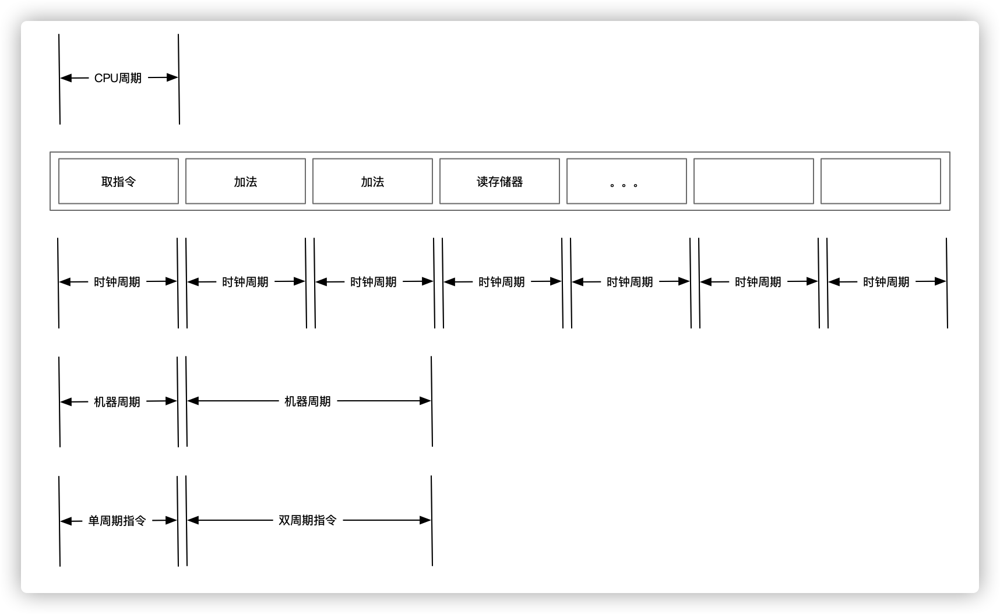

# 计算机组成 - 指令执行所需要的周期

现代计算机(冯诺依曼体系)的核心是CPU，CPU依靠一定的频率读取下一条指令，然后翻译并执行。如此往复循环。这个固定的频率好比人类的心跳一样，如果频率消失，则CPU将无法工作。

这个频率是由主板上面的晶振产生的，除了CPU之外的组件都使用这个频率工作。但CPU运行频率远远大于晶振产生的频率，所以CPU内部会有一个倍频(用来扩大频率)，所以`CPU真实频率 = 基频 X 倍频`。

本文聚焦于CPU内部周期。

一个程序(汇编级别，不考虑高级语言)在运行时，存在以下几个阶段:

- 取指令地址
- 分析指令(译码)
- 执行指令
- 结果写入寄存器

由此就会出现几个周期：CPU周期、机器周期、时钟周期和指令周期。

时钟周期是根据CPU频率取倒数得到的，例如频率是3GHZ(三十亿次/秒)，则时钟周期则是 1/3GHZ(3.3*10-10秒)。因此`时钟周期则是CPU内部最基本的周期`。

CPU周期则是时钟周期另外的一种称呼，因此`CPU周期等同于时钟周期`。

`机器周期则是完成一个基本指令阶段所需要的时钟周期之和`。例如一条指令通常包括若干个阶段，取指令阶段，译码阶段，读取寄存器阶段。 而完成一个基本阶段所需要的时钟周期之和就是机器周期。在同一个指令集中，机器周期的时间是固定的，例如12个时钟周期等等。

最后则是指令周期，`指令周期是执行一条指令所需要的时钟周期之和`，通常会将单机器周期可以完成的指令称为单周期指令，需要两个周期完成的指令称之为双周期指令。

最后使用一张图来描述这几种周期的关系，如下所示：

# 思考环节

## Question 1

+ Q: 时钟频率对CPU性能有什么影响？

    A: CPU内部是大规模集成电路，有晶体管组成。 当时钟频率过快时，晶体管快速切换状态会产生大量的热量。好比，一个人走路不会出汗，但100米冲刺跑就会出汗一样。 因此当频率调高(超频)以后，CPU内晶体管以更高的频率调整状态，带来功耗的增加，同时也会带来更高的热量。

## Question 2

+ Q: 为什么需要倍频，直接调高主板晶振频率不就可以了么？

    A: 首先晶振频率有上限，当到达上限后无法稳定产生固定的频率。 其次主板上其他设备不需要非常高的工作频率。当前晶振提供的工作频率已经可以满足这些设备的维护数据需要。 而CPU如果也以这么低的频率工作的话，会降低整体系统计算量。所以CPU内部通过另外的电路提供了倍频的功能，倍频通过将基频成倍数增加来满足CPU高频工作的需要。

## Question 3

+ Q: 如果将CPU做大增加散热面积，是不是就可以将主频做的高一些?

    A: 不能。 因为热量是单位面积内晶体管做功产生的，除非拉开晶体管的距离否则不能降低单位面积产生的热量。但拉开距离后，又会延长信号传输的时间，降低计算速度。一味增加主频并不是提高计算性能的良药，可以参考著名的奔腾4 CPU。 这款是目前市面主频最高的CPU 3.8GHZ，最终仍然以失败而告终。